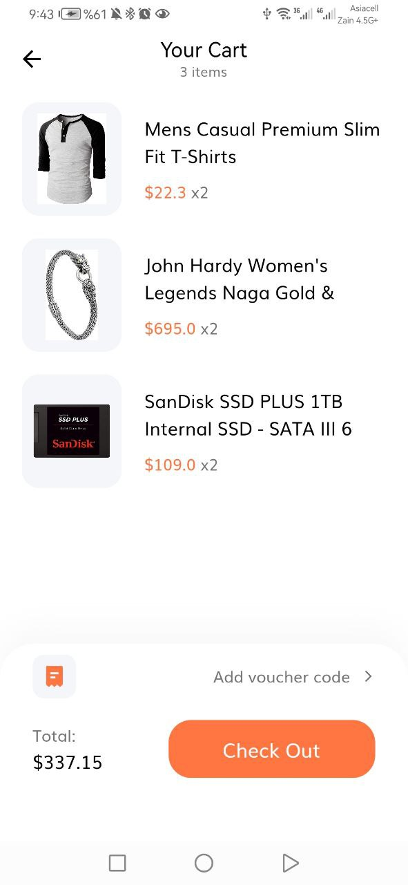
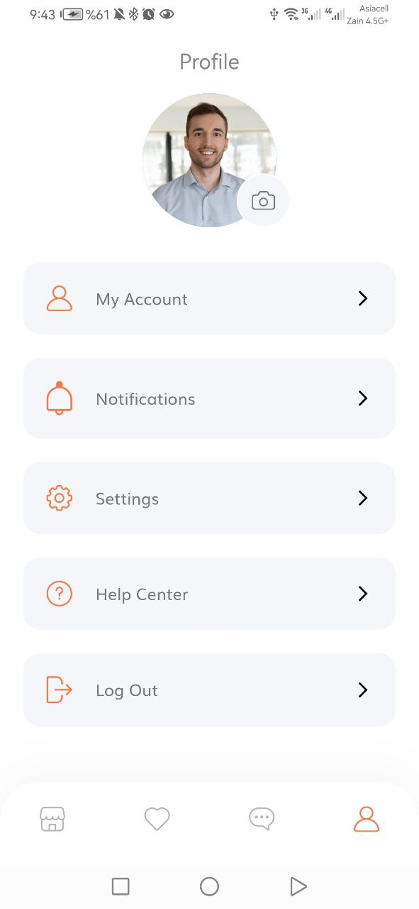

# Flutter E-Commerce App

An e-commerce app is a mobile application built using the Flutter framework. 
It includes features such as user registration, login, and secure authentication methods. Users can browse and purchase products, manage their shopping cart, make secure payments, and track orders, all while ensuring their data and transactions are protected. The app offers a visually appealing interface, smooth performance, and a seamless user experience.

## I'm using in this project :
  - Firebase Authintication
  - Firebase Firestore database
  - Get products data from Api
  - MVVM & BLoC Architecture Pattern
  - Dependency injection using get_it

## Screenshots 
  - OnBoarding Screen :
 
 

  
  
 
  - Authintication :
 
 

 
 
 
 
 
 
 

- Home Screen :
  
  
 
 
 

- Product Details Screen :
 
 
 
 

 
 

- Cart Screen :
 
 
 
 

 
 

- Profile Screen :
 
 
 
 